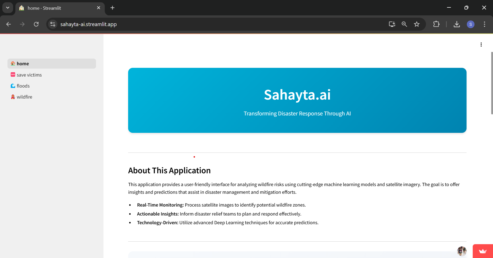
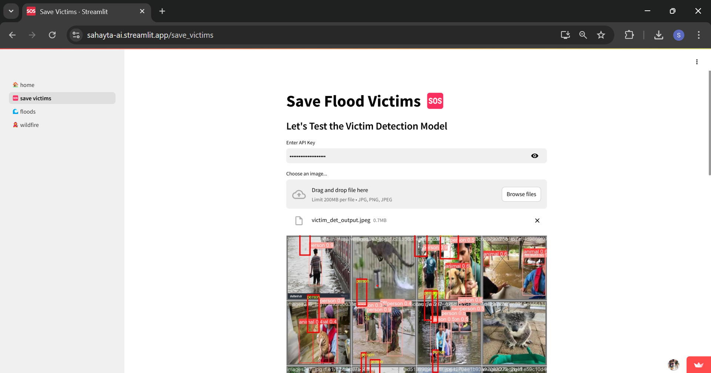
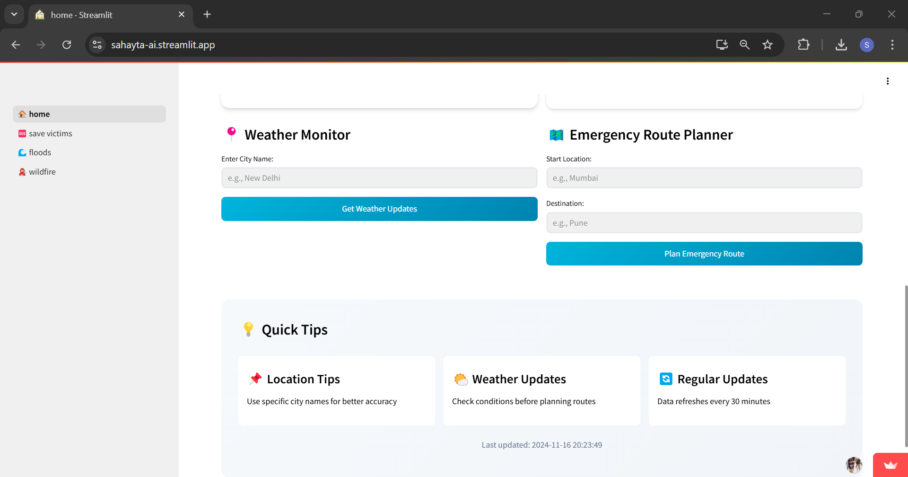

# Sahayta.ai - Smart Relief
### *Transforming Disaster Response Through AI*



## 🎯 Overview
Sahayta.ai is a cutting-edge disaster relief and response solution that harnesses the power of advanced technology to revolutionize disaster management. Our system integrates satellite imagery analysis, drone-based surveillance, and AI-driven algorithms to enhance emergency response during floods, wildfires, and other natural disasters.

## 🚀 Key Features

### 1. Early-Stage Wildfire Detection
- **Satellite Integration**: Leverages NOAA-20 VIIRS satellite imagery
- **Real-time Monitoring**: Early detection and alert system
- **Rapid Response**: Immediate notification to disaster relief teams

### 2. Drone-Based Victim Detection
- **Advanced Computer Vision**: Implements YOLOv8 algorithms
- **High-Resolution Imaging**: Real-time aerial surveillance
- **Swift Search & Rescue**: Rapid victim localization in flood-affected areas
  


### 3. AI-Powered Flood Analysis
- **Semantic Segmentation**: Advanced satellite imagery analysis
- **Resource Optimization**: Data-driven decision support
- **Strategic Planning**: Actionable insights for emergency responders

### 4. Integrated Emergency Response System
- **Real-time Weather Updates**: Dynamic weather condition monitoring
- **Geolocation Integration**: High-risk zone identification
- **Animal Welfare Protection**: Tracking and rescue coordination
- **Predictive Analytics**: Weather-location correlation for risk assessment




## 📊 Performance Results

### Victim Detection Analysis
View our detection results in `detectFloodVictims/runs/detect/train`


### Wildfire Detection Performance


### Flood Segmentation Results


## 🛠️ Quick Start Guide

### Online Demo
Try our Flood Victim Detection model: [Live Demo](https://nepec3kih4bktgprzszr5p.streamlit.app/)

### Local Installation

1. **Clone the Repository**
   ```bash
   git clone https://github.com/your-username/disaster-relief-solution.git
   ```

2. **Install Dependencies**
   ```bash
   pip install -r requirements.txt
   ```

3. **Launch Applications**
   - For Flood Victim Detection:
     ```bash
     streamlit run app.py
     ```
   - Check Flood Detection and Wildfire results using provided scripts
   - Find Flood Segmentation outputs in `./Flood_mapping`

## 📚 Documentation
Detailed documentation available in the `docs/` directory covering:
- System architecture
- API documentation
- Model specifications
- Deployment guides
- Usage tutorials

## 📄 License
This project is licensed under the [MIT License](LICENSE).

## 🙏 Acknowledgments
We extend our gratitude to:
- The open-source community
- Our development partners
- Collaborators and testers

---

<div align="center">

**Sahayta.ai - Smart Relief**  
*Technology that saves lives*

[Documentation](docs/) | [Report Issues](issues/) | [Contribute](CONTRIBUTING.md)

</div>
