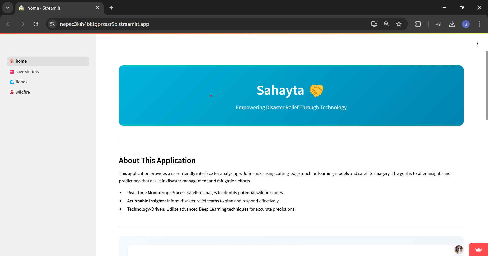
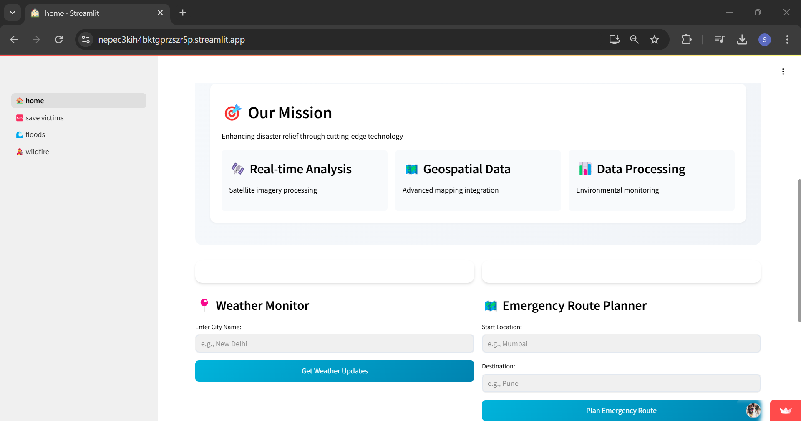
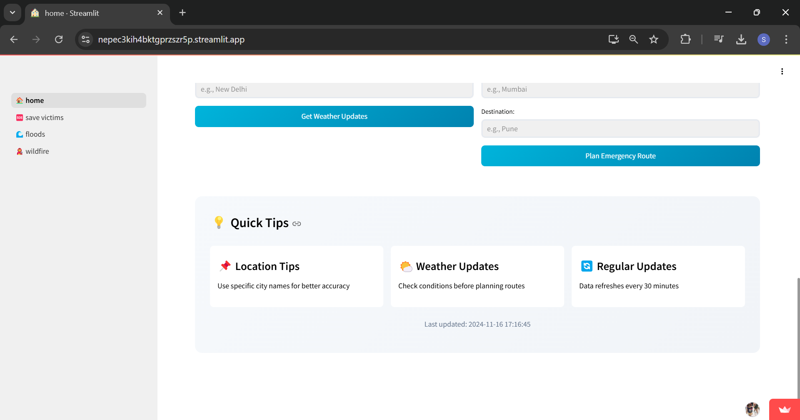
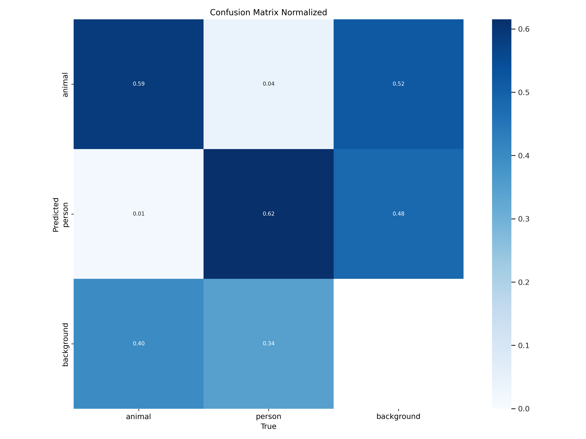
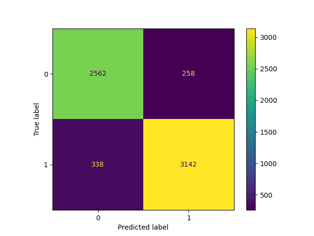
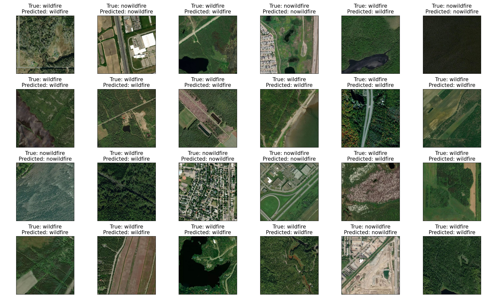

# Sahayta.ai - Smart Relief
"
# Transforming Disaster Response Through AI

## Overview
This repository contains the codebase and documentation for a disaster relief and response solution aimed at leveraging advanced technology to enhance disaster management efforts, particularly during events like floods and wildfires. The solution integrates satellite imagery analysis, drone-based victim detection, and AI-driven algorithms to improve situational awareness, resource allocation, and response coordination.

## Solution Approach
The solution approach can be summarized as follows:

1. **Detect WildFires in Early stages from Satellite Images** The solution utilizes satellite imagery, particularly NOAA-20 satellites called VIIRS, for detection of Wildfires in early stages so that Disaster Relief teams can be sent the information before, expeding Disaster Relief.

2. **Drone-Based Victim Detection in Floods:** Drones equipped with high-resolution cameras are deployed for aerial imagery capture and victim detection in disaster-affected areas. Computer vision algorithms like YOLOv8 analyze drone imagery to identify and localize individuals in need of assistance, facilitating swift search and rescue operations.

3. **Flood Detection and segmentation from Satellite Imagery** AI techniques are applied for data analysis and decision support, including semantic segmentation of satellite imagery,and optimization of resource allocation. These algorithms provide actionable insights to emergency responders and relief agencies, aiding in strategic planning and response coordination.

4. **Integrated Location and Weather Intelligence for Emergency Response and Welfare"** The system integrates geolocation data and real-time weather updates to support animal rescue and welfare. It identifies high-risk zones, tracks animal movements, and uses spatial data analysis for efficient resource allocation. Weather APIs provide updates on conditions like storms and floods, enabling risk prediction by correlating weather and location data. This approach empowers rescue teams with actionable insights for timely interventions, ensuring animal safety during emergencies.

## Results

# Victim Detection 
results in detectFloodVictims/runs/detect/train

# Flood Segmenation

## Getting Started
To use the disaster relief and response solution, follow these steps:
# Use deployed app to check Flood Victim Detection model: https://nepec3kih4bktgprzszr5p.streamlit.app/

# Run it in your local machine:
1. Clone the repository to your local machine: `git clone https://github.com/your-username/disaster-relief-solution.git`
2. Install the necessary dependencies and libraries as specified in the documentation.
3. Install requirements for streamlit app
`pip install -r requirements.txt`
4. Set up the environment and configure the solution parameters according to your requirements.
5. To Check results for Victim Detection in Floods
` streamlit run app.py`
6. To check Results for Flood Detection and Segmentation and Wildfire detection, Run the provided scripts and modules to execute the solution components, analyze data, and generate insights.
7. Output images from Flood Segmentation model training is saved in `./Flood_mapping` 

## License
This project is licensed under the [MIT License](LICENSE).

## Acknowledgments
We would like to acknowledge the contributions of the open-source community and the support of our partners and collaborators in developing and testing this disaster relief and response solution. Thank you for your support!

---
**Note:** This README file provides an overview of the disaster relief and response solution and serves as a starting point for understanding the project structure and functionality. For detailed instructions and documentation, please refer to the files in the `docs/` directory.
